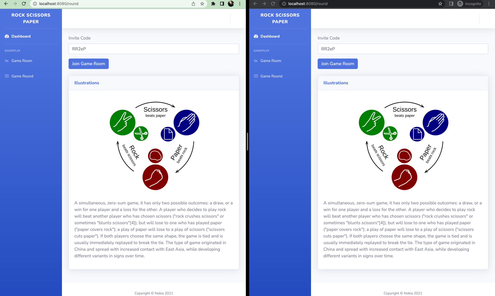
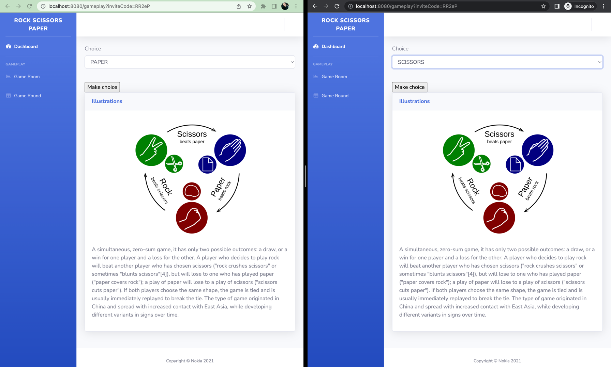
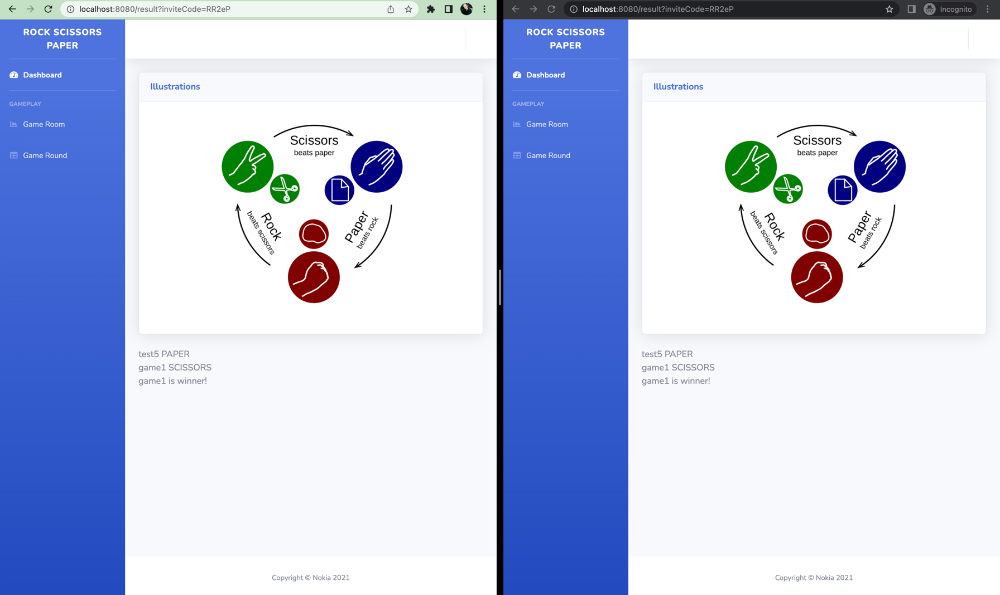

# Rock Paper Scissors

## Project setup

1. Ensure that you have installed and running Docker and Docker-compose
   * Install Docker [Docker](https://www.docker.com/products/docker-desktop)
   * Install Docker-compose  [docker-compose](https://docs.docker.com/compose/install/)
2. Run mvn package to build project(from the root folder)
   ```
   mvn package
   ```
3. Run command (from the root folder). It will start docker container
   ```
   docker-compose up
   ```
4. Now you can go to http://localhost:8080 and access application

## Playing against computer is fun, but it is more fun to play with people :)
1. Create an account (for Player 1 and Player 2)
* Go to http://localhost:8080/registration
* Enter Username and Password
* You will be redirected to login page

###You could use predefined users to skip registration/login steps
   ```
   username1: admin1
   password1: admin1
   ```
   ```
   username2: admin2
   password2: admin2
   ```
2. Go to http://localhost:8080/login
3. Player 1 should create Game Room http://localhost:8080/game-room
4. Player 1 should join Game Room and pass Invite code to Player 2
5. Player 2 should join Game Room using Invite code provided by Player http://localhost:8080/round
6. Player 1 and Player 2 should select choices
7. See the results
8. To play a new game create a new Game Room



